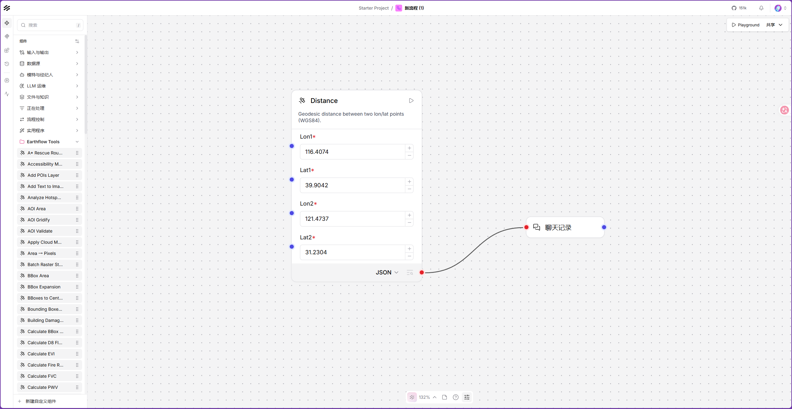
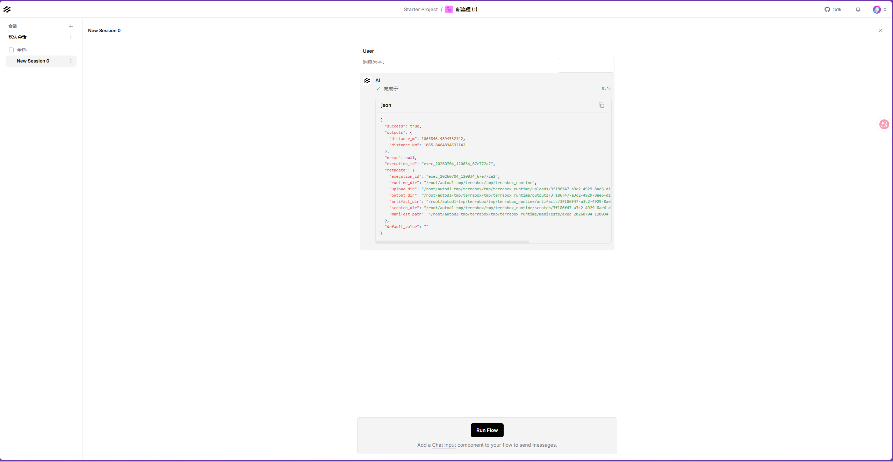
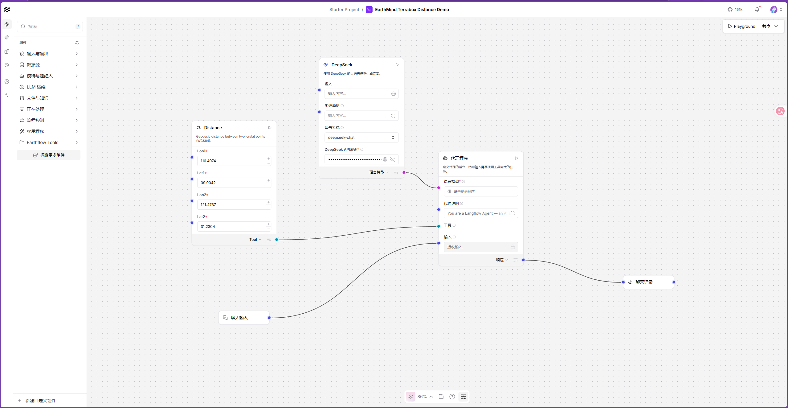
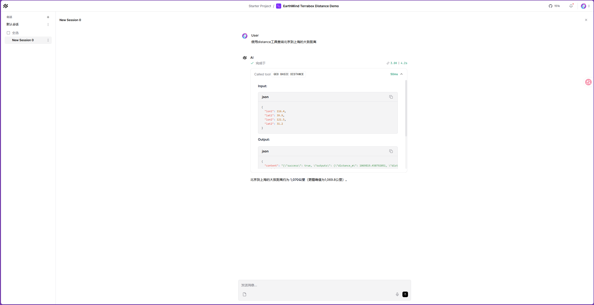

# EarthMind Terrabox Tool Components

This document summarizes the current EarthMind integration for Terrabox geospatial
tools. The goal is to make EarthMind's Langflow UI more focused on remote-sensing
and geospatial workflows while exposing Terrabox tools as reusable Langflow
components.

## Background

EarthMind is based on Langflow and provides the workflow and agent orchestration
layer. Terrabox provides the geospatial tool backend: tool registration, JSON
Schema definitions, REST execution, runtime files, API keys, and MCP exposure.

The two projects stay independently deployed and versioned. EarthMind depends
on Terrabox in two distinct ways:

- **Component generation (build-time):** `terrabox[geo]` is a regular pinned
  package dependency (see `terrabox` in the root `pyproject.toml`'s
  `[tool.uv.sources]`, pinned to a tagged release on
  `github.com/earth-flow/terrabox`). `lfx` imports `terrabox.core.registry` and
  the `terrabox.toolkits.*` modules directly, the same as any other dependency
  — no separate Terrabox checkout or `PYTHONPATH`/`sys.path` setup is needed.
- **Tool execution (runtime):** generated components call a *live* Terrabox
  REST API over HTTP at `TERRALINK_BASE_URL`. This still requires Terrabox to
  be running as its own service, since it owns its own database, auth, and API
  key issuance independently of EarthMind.

Bumping the Terrabox toolkit registry (adding/removing tools) means cutting a
new Terrabox release tag and updating the pin in EarthMind's `pyproject.toml`
(`uv lock` afterwards) — the same workflow as updating any other dependency.

## Implementation Overview

The integration has two parts.

First, EarthMind filters the native Langflow component catalog with an allowlist.
This hides unrelated default components while keeping the components needed for
remote-sensing workflows, including chat input/output, DeepSeek, Agent, Prompt
Template, search tools, flow controls, basic file handling, and common data
processing components.

Second, EarthMind dynamically loads Terrabox `ToolSpec` definitions and converts
them into Langflow component templates. Each generated Terrabox component exposes:

- `Terrabox Base URL`, defaulting to `http://localhost:8000`.
- `Terrabox API Key`, kept as a secret input.
- `Timeout`.
- Tool-specific inputs generated from the Terrabox JSON Schema.
- A JSON output for direct tool execution.
- A Tool output for Agent tool-calling workflows.

The main code paths are:

- `src/lfx/src/lfx/interface/components.py`
- `src/lfx/src/lfx/interface/earthflow_components.py`
- `src/lfx/src/lfx/interface/earthflow_terrabox.py`
- `src/lfx/tests/unit/interface/test_earthflow_components.py`

## Default Tool Policy

EarthMind currently enables 105 Terrabox tool components by default. The default
toolkits include:

- `geo_basic`
- `geo_raster`
- `earth_sci`
- `disaster_response`
- `stac_basic`
- `osm_gis`
- `geoanalysis`
- `geo_statistics`
- `raster_viewer`
- `geopatch`
- lightweight `geo_perception` tools

The lightweight `geo_perception` subset is limited to:

- `geo_perception.draw_bboxes`
- `geo_perception.add_text`
- `geo_perception.ocr_extract`
- `geo_perception.bbox_expand`
- `geo_perception.bbox_to_centroid`
- `geo_perception.centroid_distance_extremes`
- `geo_perception.bbox_area`

The following `geo_perception` model-service tools are excluded by default
because they require Docker, model services, model weights, and additional
runtime setup:

- `geo_perception.vlm_analyze`
- `geo_perception.sam2_segment`
- `geo_perception.remoteclip_analysis`
- `geo_perception.strip_rcnn_detect`
- `geo_perception.remotesam`
- `geo_perception.instructsam`

The following high-risk or external-connection toolkits are also not enabled by
default:

- `bash`
- `ipython`
- `github`
- `bing_search`
- `example`

## Configuration

EarthMind component filtering can be disabled if needed:

```bash
export EARTHFLOW_COMPONENTS_ENABLED=0
```

Terrabox toolkit-level filters:

```bash
export EARTHFLOW_TERRABOX_TOOLKITS=geo_basic,geo_raster,earth_sci
export EARTHFLOW_TERRABOX_EXCLUDE_TOOLKITS=bash,ipython,github
```

Terrabox tool slug-level filters:

```bash
export EARTHFLOW_TERRABOX_TOOLS=geo_basic.distance,geo_perception.bbox_area
export EARTHFLOW_TERRABOX_EXCLUDE_TOOLS=geo_perception.vlm_analyze
```

Terrabox service configuration:

```bash
export TERRALINK_BASE_URL=http://127.0.0.1:8000
```

Do not commit real Terrabox API keys. Configure the API key in the component
secret field or via a local environment variable only when running the workflow.

Local Terrabox development override (only needed if you're developing against
an editable Terrabox checkout instead of the pinned dependency):

```bash
export EARTHFLOW_TERRABOX_SRC=/path/to/local/terrabox/src
```

## UI Verification

The screenshot below shows the filtered EarthMind Langflow UI with the
`earthflow tools` category and a generated Terrabox Distance component on the
canvas.



The Distance component can run as a JSON-output component. In this mode, the
component calls the Terrabox REST API directly and returns the tool result to
downstream components such as Chat Output.



The same generated Terrabox component also exposes a Tool output. This allows an
Agent to call the Terrabox tool during a conversation.



The screenshot below shows a lightweight Agent workflow using the Distance tool.



## Running EarthMind

`terrabox[geo]` installs like any other dependency via `uv sync`
(`make init`/`make backend`/`make run_clic`); no separate Terrabox checkout or
`PYTHONPATH` setup is required for component generation. Terrabox still needs
to be running as its own live service for tool execution:

```bash
export EARTHFLOW_COMPONENTS_ENABLED=1
export TERRALINK_BASE_URL=http://127.0.0.1:8000

uv run earthmind run --host 0.0.0.0 --port 7860
```

Terrabox should be running separately on the configured `TERRALINK_BASE_URL`.

## Validation

The focused Earthflow component tests can be run with:

```bash
cd src/lfx
LFX_TEST_ALLOW_LANGFLOW=1 PYTHONPATH=src python -m pytest tests/unit/interface/test_earthflow_components.py -q
```

Current focused result:

```text
6 passed, 7 warnings
```

The Terrabox schema-loading smoke test confirmed:

- 105 Terrabox specs are loaded by default.
- 105 Langflow component templates are generated.
- `geopatch.train_init`, `geopatch.generate_seg`,
  `geo_perception.bbox_area`, `geo_perception.draw_bboxes`, and
  `geo_perception.ocr_extract` are included.
- Heavy model-service tools such as `geo_perception.vlm_analyze` and
  `geo_perception.sam2_segment` are excluded by default.

## Current Limitations

- Component generation is pinned to a specific Terrabox release tag (see
  `terrabox` in `[tool.uv.sources]`); picking up newly added Terrabox tools
  requires bumping that pin, not just restarting EarthMind.
- Running a Terrabox component requires a live Terrabox backend and a valid
  Terrabox API key.
- Heavy perception tools are intentionally excluded by default because the
  current environment does not provide the required Docker/model-service setup.
- `bash`, `ipython`, `github`, and external-search tools are not default-enabled
  because they require additional security, token, or connection handling.

## Next Direction

The next step is not to keep expanding the remaining high-risk tools by default.
The current priority is to connect the existing `langflow-flowgen` MCP and
Claude Skill with EarthMind/Terrabox, so generated Langflow JSON can include
Terrabox tool components and produce EarthMind-ready geospatial workflows.
